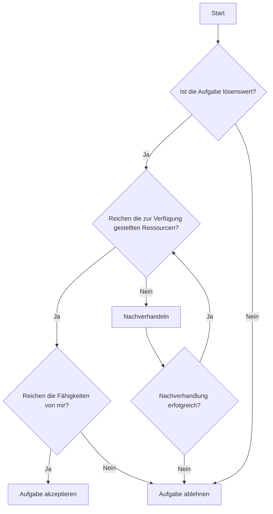

# Handlungsempfehlung

*„erweiterte Machbarkeitsanalyse“*

```mermaid
flowchart TD
    S[Start] --> Lösenswert{Ist die Aufgabe lösenswert?}
    Lösenswert -->|Ja| Ressourcen{Reichen die zur Verfügung gestellten Ressourcen?}
    Lösenswert -->|Nein| Ablehnen
    Ressourcen -->|Ja| Fähigkeiten{Reichen die Fähigkeiten von mir?}
    Ressourcen -->|Nein| Nachverhandeln --> Erfolgreich{Nachverhandlung erfolgreich?}
    Erfolgreich -->|Ja| Ressourcen
    Erfolgreich -->|Nein| Ablehnen
    Fähigkeiten -->|Ja| Akzeptieren[Aufgabe akzeptieren]
    Fähigkeiten -->|Nein| Ablehnen[Aufgabe ablehnen]
```
