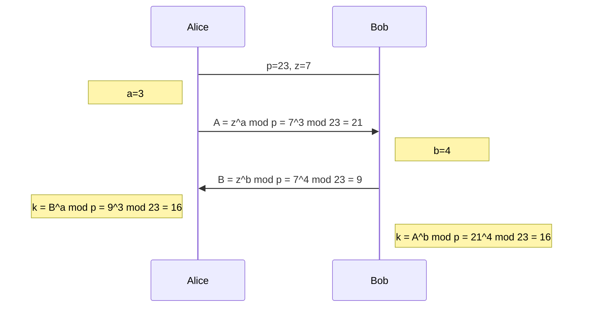

# Grundlagen Kryptografie

> [BSI TR-02102](https://www.bsi.bund.de/DE/Themen/Unternehmen-und-Organisationen/Standards-und-Zertifizierung/Technische-Richtlinien/TR-nach-Thema-sortiert/tr02102/tr02102_node.html) „Kryptographische Verfahren: Empfehlungen und Schlüssellängen“

## Verschlüsselung

### Symmetrisch

#### Polyalphabetische Ersetzungschiffren (z.B. Vigenère-Chiffre)

<samp>&nbsp; WETTERVORHERSAGEBISKAYA</samp> (Klartext1) 
<samp>+ NGMNIAKRBOGPITRFMEORCBI</samp> (Schlüssel) 
<samp>= JKFGMRFFSVKGATXJNMGBCZI</samp> (Ciphertext1)

<samp>&nbsp; IUZOMFOYMGNPJXIIQVGZEIM</samp> (Ciphertext2)

> Aufgabe 1: Angenommen, du hast obrige beiden Ciphertexte empfangen, den Klartext1 erraten und damit den „Tagesschlüssel“ berechnet (known-plaintext attack). Entschlüssel Ciphertext2 (z.B. mittels [Tabula recta](https://de.wikipedia.org/wiki/Tabula_recta))
>
> Aufgabe 2: Wie kann diese Art von Angriff verhindert werden?

#### [One-Time-Pad](https://de.wikipedia.org/wiki/One-Time-Pad)

#### [AES](https://www.youtube.com/watch?v=O4xNJsjtN6E)

### Asymmetrisch

### Schlüsselaustausch

#### Diffie-Hellman

## Signaturen

## [(Kryptographische) Hashes](https://de.wikipedia.org/wiki/Kryptographische_Hashfunktion)

Anforderungen:
* Feste Länge der Hash-Werte
* Einweg-Funktion („Falltür-Funktion“)
* „Kollisionsfreiheit“ / „Kollisionsresistenz“

