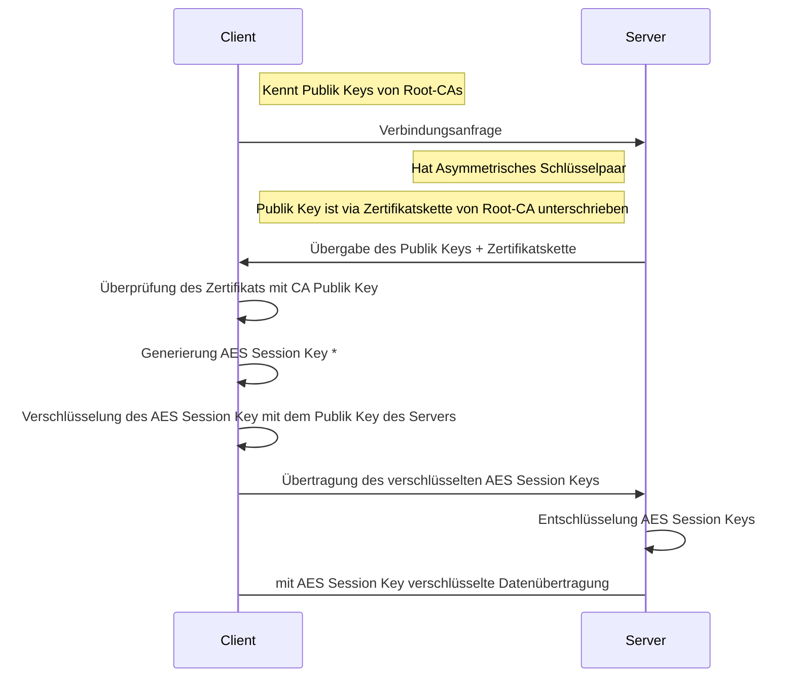

# Netzwerksicherheit

## [Zero Trust Security / Zero Trust Architektur (ZTA) / Zero Trust Network Access (ZTNA)](https://de.wikipedia.org/wiki/Zero_Trust_Security)

## [SSL/TLS](https://de.wikipedia.org/wiki/Transport_Layer_Security) [(vereinfacht)](https://de.wikipedia.org/wiki/Transport_Layer_Security#/media/Datei:SSL_handshake_with_two_way_authentication_with_certificates.svg)



> `*` bzw. [Diffie-Hellman-Schlüsselaustausch](https://de.wikipedia.org/wiki/Transport_Layer_Security#TLS_Handshake_Protocol)

> IHK-Prüfung Winter 2021/22

> IKH-Prüfung IDS HTTPS-Entschlüsselung

## [Firewalls](firefalls.md)

### NAT
(**N**etwork**A**ddress**T**ranslation)
-> NAPT (**N**etwork**A**ddress**P**ort**T**ranslation)

* SNAT (**S**ourceNAT) / Masquerading
* DNAT (**D**estinationNAT)
* …
  * Full NAT
  * 1:1 NAT
  * No NAT

```bash
echo 1 | sudo tee /proc/sys/net/ipv4/ip_forward
iptables -t nat -A POSTROUTING -o eth0 -j MASQUERADE
```


> IHK Abschlussprüfung Winter 2023/24 Analyse+Entwicklung Aufgabe 2

### VLAN

* Access-Mode, Trunk-Mode, Hybrid-Mode

* Zuweisung z.B. auf Basis von
  * Anschluss-Port
  * MAC
  * IP
  * IP + TCP/UDP-Port
  * Authentifizierung mit Zertifikaten

| Schicht | Administrationsaufwand | Flexibilität | Sicherheit |
|---------|------------------------|--------------|------------|
| 1       | +                      | -            | -          |
| 2       | (-)                    | (-)          | -          |
| 3       | (-)                    | +            | -          |
| 4       | (-)                    | +            | (-)        |
| 5-7     | (-)                    | +            | (+)        |

```bash
### Vorbereitung:
lsmod | grep 8021q
sudo modprobe 8021q

### Virtuelles Interface für VLAN-ID 200 anlegen:
sudo ip link add link wlan0 name wlan0.200 type vlan id 200
```

> IHK Abschlussprüfung Winter 2023/24 Analyse+Entwicklung Aufgabe 3

## [VPN](vpn.md)

## Proxy
* Caching
* Filtern -> Verfügbarkeit (+ Versuch des Schutzes vor schädlichen Inhalten)
* Kontrolle -> Vertraulichkeit
* Manipulation -> Integrität
  * z.B. [„Upside-Down-inTernet“](https://pete.ex-parrot.com/upside-down-ternet.html)

### ReverseProxy
#### SSL-Offloading/TLS-Termination

## Radius

* „AAA“
  * Authentication
  * Authorization
  * Accounting
