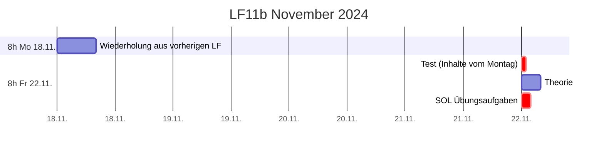
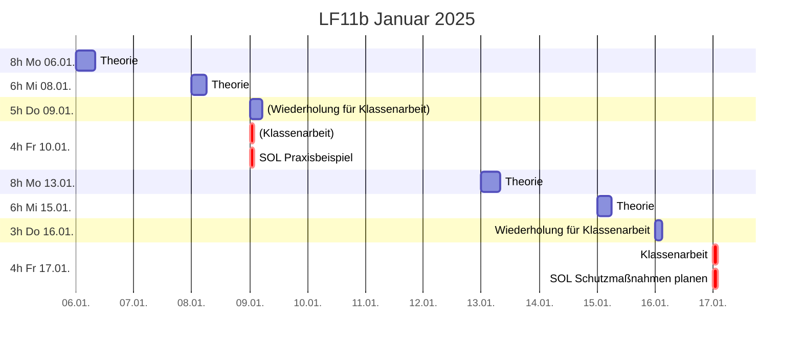
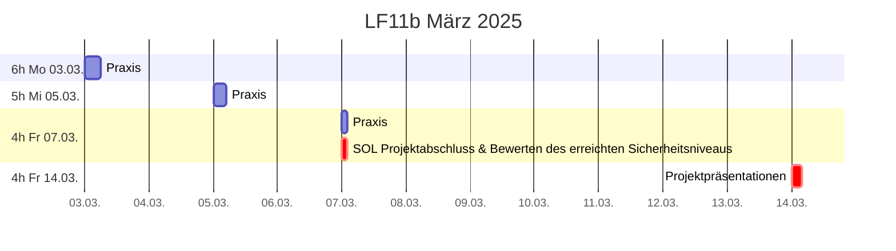

# Plan

## Zeitplan

## Unterrichtsinhalte 13.1. (8 Stunden)

* [ ] Einführung: „Theorie vs. Praxis“ -> Beispiel
* [ ] Grundlagen
  * [ ] Praxisfragen
  * [ ] Threat Models
* [ ] Planung
  * [ ] Endpoint Security
  * [ ] TOM

## Unterrichtsinhalte 15.1. (6 Stunden)

* [ ] Auswertung SOL vom 10.1. (wahlweise Vorträge)
  * [ ] Gemeinsame Schutzbedarfs- und Risikoanalyse
  * [ ] Prüfung / Bewertung / Abgleich mit „Grundlagen“-Empfehlungen
* [ ] Weitere Praxisbeispiele
* [ ] Handlungsempfehlung

## Bonus

* [ ] Hackerethik (vs. [202c StGB](https://www.gesetze-im-internet.de/stgb/__202c.html))
* [ ] CTF
* [ ] „Live Hacks“ z.B.
  * [ ] SQL-Injection
  * [ ] Netzwerksicherheit
    * [ ] MITM-Proxy
    * [ ] NMap
    * [ ] Wireshark / TCPdump
  * [ ] Binary Exploitation
* [ ] Grundlagen Kryptografie

## Leistungskontrollen
* **Fr 10.01. Klausur: doppelte Wertung, 90min, handschriftlich**
  * Erlaubte Hilfsmittel: keine
  * Inhalte:
    * Netzwerksicherheit
      * Firewall, NAT 
      * VLAN
      * VPN
      * Radius (3A)

* **Fr 17.01. Klausur: doppelte Wertung, 90min, handschriftlich**
  * Erlaubte Hilfsmittel: keine
  * Inhalte:
    * Grundlagen IT-Sicherheit
      * Datenschutz
      * Verbreitete Ursachen für Sicherheitsprobleme (Angriffsvektoren/Bedrohungsszenarien)
      * Technische und organisatorische Maßnahmen
    * Grundprinzipien
      * Relative Sicherheit
      * Defense in depth / Schweizer-Käse-Modell
      * KISS-Prinzip / „teile und herrsche“
      * Secure by design, Technischer Datenschutz
      * Kerckhoffs’ Prinzip
    * Grundlegende Definitonen nach BSI-Grundschutz
      * Zielobjekte für Schutzbedarfsfeststellung
      * Schutzziele (= Grundwerte)
      * Schadensszenarien
      * Schutzbedarfskategorien
    * Schutzbedarfsanalyse, Schutzbedarfsmatrix
    * Risikoanalyse
      * Elementare Gefährdungen
      * Risikobewertung
      * Häufigkeit, Auswirkungen
      * Risikokategorien
    * Risikobehandlung
    * ~~Grundlagen Kryptografie~~
