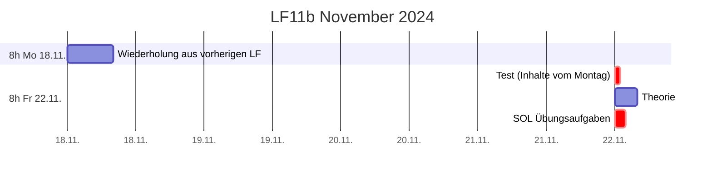
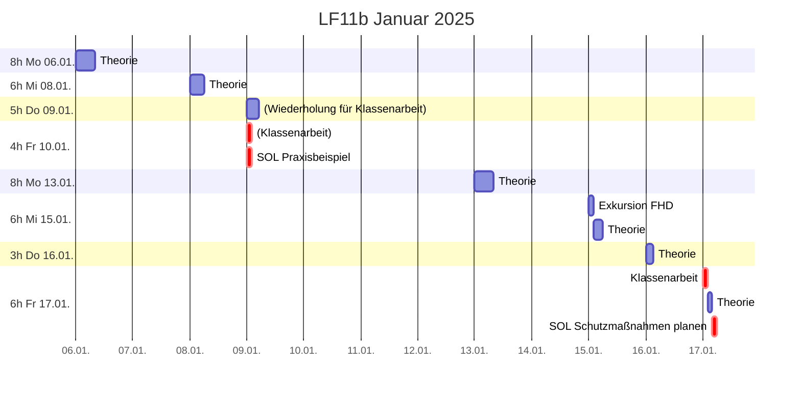
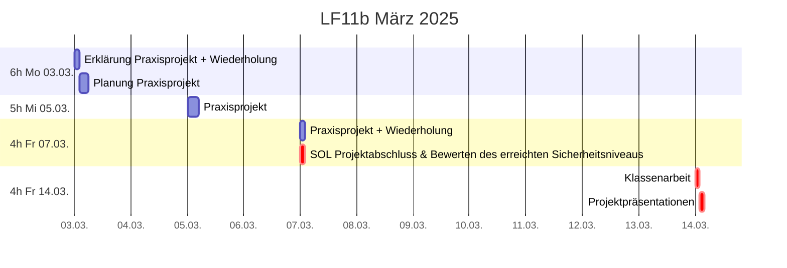

# Plan

## Zeitplan

## Unterrichtsinhalte 13.1. (8 Stunden)

* [x] Wiederholung/Vertiefung Firewall
* [x] Einführung: „Theorie vs. Praxis“ -> Beispiel
* [.] Grundlagen
  * [ ] Praxisfragen
  * [ ] Threat Models

## Unterrichtsinhalte 15.1. (~~6~~ 3 Stunden)

* [x] Auswertung SOL vom 10.1. (wahlweise Vorträge)
  * [ ] Gemeinsame Schutzbedarfs- und Risikoanalyse
  * [ ] Prüfung / Bewertung / Abgleich mit „Grundlagen“-Empfehlungen

## Unterrichtsinhalte 16.1. (3 Stunden) + März (?)

* [x] Wiederholung/Vertiefung [VPN](vpn.md)
* [ ] Planung
  * [x] [TOM](tom.md)
  * [ ] [Endpoint Security](planung.md)
* [.] Grundlagen
  * [ ] Praxisfragen
* [ ] Handlungsempfehlung

## Bonus

* [ ] Weitere Praxisbeispiele
* [x] Hackerethik (vs. [202c StGB](https://www.gesetze-im-internet.de/stgb/__202c.html))
* [ ] CTF
* [ ] „Live Hacks“ z.B.
  * [ ] SQL-Injection
  * [ ] Netzwerksicherheit
    * [ ] MITM-Proxy
    * [ ] NMap
    * [ ] Wireshark / TCPdump
  * [ ] Binary Exploitation
* [ ] Grundlagen Kryptografie

## Leistungskontrollen
* **Fr 17.01. Klausur: doppelte Wertung, 90min, handschriftlich**
  * Erlaubte Hilfsmittel: keine
  * Inhalte:
    * Netzwerksicherheit
      * Firewall, NAT 
      * VLAN
      * VPN
      * Radius (3A)

* **Fr 14.03. Klausur: doppelte Wertung, 90min, handschriftlich**
  * Erlaubte Hilfsmittel: A4 Factsheet einseitig
  * Inhalte:
    * [Grundlagen IT-Sicherheit](grundlagen.md)
      * Datenschutz
      * Verbreitete Ursachen für Sicherheitsprobleme (Angriffsvektoren/Bedrohungsszenarien)
      * **[Technische und organisatorische Maßnahmen](tom.md)**
    * **Grundprinzipien**
      * Relative Sicherheit
      * Defense in depth / Schweizer-Käse-Modell
      * KISS-Prinzip / „teile und herrsche“
      * Secure by design, Technischer Datenschutz
      * Kerckhoffs’ Prinzip
    * [Grundlegende Definitonen nach BSI-Grundschutz](analyse.md)
      * **Zielobjekte für Schutzbedarfsfeststellung**
      * **Schutzziele (= Grundwerte)**
      * **Schadensszenarien**
      * **Schutzbedarfskategorien**
    * Schutzbedarfsanalyse, Schutzbedarfsmatrix
    * **Risikoanalyse**
      * **Elementare Gefährdungen**
      * **Risikobewertung**
      * Häufigkeit, Auswirkungen
      * Risikokategorien
    * **[Risikobehandlung](planung.md)**
    * ~~Grundlagen Kryptografie~~

* **Projektarbeit**: zwei kleine Noten (Projektergebnis + Mitarbeit)
  * Vorlage: [pdf](material/projektarbeit_lf11b.pdf), [odt](material/projektarbeit_lf11b.odt)
