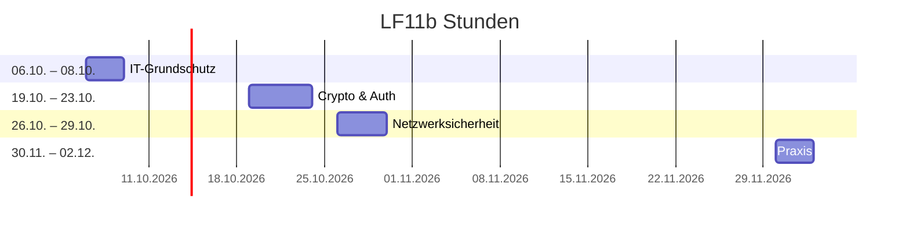

# Plan

## Zeitplan

```mermaid
gantt
    title LF11b Stunden
    dateFormat YYYY-MM-DD
    axisFormat %d.%m.%Y
    section 06.10. – 08.10.
        IT-Grundschutz : 2026-10-06, 3d
    section 19.10. – 23.10.
        Crypto & Auth : 2026-10-19, 5d
    section 26.10. – 29.10.
        Netzwerksicherheit : 2026-10-26, 4d
    section 30.11. – 02.12.
        Praxis : 2026-11-30, 3d
```

<!--

## Leistungskontrollen
* **Fr 28.11. Klassenarbeit: doppelte Wertung, 90min, handschriftlich**
  * Erlaubte Hilfsmittel: A4 Factsheet einseitig
  * Themen: Alles was im Unterricht in der KW48 behandelt wurde…
  * **Schwerpunkte**:
    * [Datenschutz & Datensicherheit](https://johannesloetzsch.github.io/LF4/dud.html): Begriffsunterscheidung
      * [Datenschutz](https://johannesloetzsch.github.io/LF4/datenschutz.html): 2 besonders relevante Gesetze
        * [Prinzipien](https://johannesloetzsch.github.io/LF4/datenschutz_prinzipien.html): Verbot mit Erlaubnisvorbehalt, Zweckbindung
        * [Datensparsamkeit](https://johannesloetzsch.github.io/LF4/datensparsamkeit.html): Privacy by Default, Privacy by Design, Anonymität, Pseudonymität
      * [Datensicherheit](https://johannesloetzsch.github.io/LF4/datensicherheit.html): Safety vs. Security, Schutzziele / Hauptziele / Grundwerte, Relative Sicherheit, „Stand der Technik“, Qualität
        * [Sicherheitsmanagement](https://johannesloetzsch.github.io/LF4/ism.html): ISO 27001, IT-Grundschutz-Methodik
    * [Gefährdungen](https://johannesloetzsch.github.io/LF4/gefährungen.html): Malware, Ransomware, Würmer, Trojaner, Phishing, Spear-Phishing, DoS, DDoS
    * [TOM](https://johannesloetzsch.github.io/LF4/tom.html) (verstehen)
      * [Endgerätesicherheit](https://johannesloetzsch.github.io/LF4/endgerätesicherheit.html) (Maßnahmen beschreiben)
      * [Grundlagen Authentifizierung](https://johannesloetzsch.github.io/LF4/authentifizierung.html)
      * [Grundlagen Kryptographie](https://johannesloetzsch.github.io/LF4/kryptographie.html)
    * [IT-Grundschutz-Methodik](https://johannesloetzsch.github.io/LF4/grundschutz.html): Basis-, Kern-, Standard-Absicherung
      * [Vorgehen](https://johannesloetzsch.github.io/LF4/grundschutz_methodik.html)
      * [Schutzbedarfsanalyse](https://johannesloetzsch.github.io/LF4/schutzbedarfsanalyse.html) 
      * [Risikoanalyse](https://johannesloetzsch.github.io/LF4/risikoanalyse.html)
      * [IT-Grundschutz-Check](https://johannesloetzsch.github.io/LF4/grundschutz_check.html) (Nutzung von IT-Grundschutz-Bausteinen, Arbeiten mit Checklisten)

* **zweite Klassenarbeit** => 19.12. (AE) bzw. 09.01. (SI)

* **Projektarbeit**:
  * Vorlage (Vorschlag): [pdf](material/projektarbeit_lf11b.pdf), [odt](material/projektarbeit_lf11b.odt)

  * eine kleine Note für Projektplanung (insbesondere Schutzbedarfsanalyse) => SOL vom 28.11.
  * zwei kleine Noten (Projektergebnis + Mitarbeit) => Präsentation am 09.01.

## Bonus
=> Bei Interesse bitte melden

* [ ] Weitere Praxisbeispiele
* [ ] Hackerethik (vs. [202c StGB](https://www.gesetze-im-internet.de/stgb/__202c.html))
* [ ] CTF
* [ ] „Live Hacks“ z.B.
  * [ ] SQL-Injection
  * [ ] Netzwerksicherheit
    * [ ] MITM-Proxy
    * [ ] NMap
    * [ ] Wireshark / TCPdump
  * [ ] Binary Exploitation

-->
