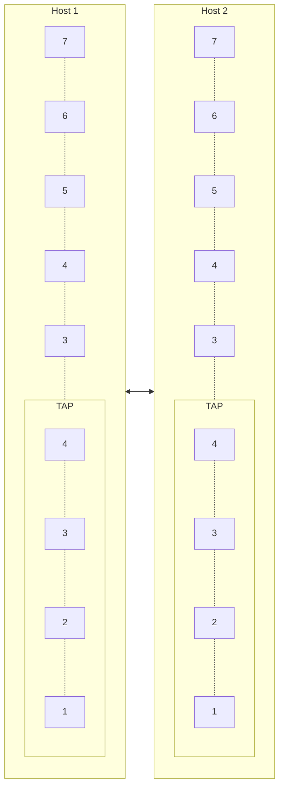

# [VPN](https://de.wikipedia.org/wiki/Virtual_Private_Network)

„virtuelles privates Netzwerk“

## [Netzwerktunnel](https://de.wikipedia.org/wiki/Tunnel_(Rechnernetz)) / [Overlay-Netzwerk](https://de.wikipedia.org/wiki/Overlay-Netz)

Die unteren Schichten des OSI-Modells werden als „**Transportnetz**“ verwendet um darüber andere Protokolle zu sprechen.
In VPNs (Tunneln und allgemein in Overlay-Netzwerken) ist es üblich, dass Protokolle aus normalerweise niedrigeren Layern über Protokolle höherer Layer transportiert werden.

VPNs laufen häufig auf den Layern 3, 4 oder 5 des Transportnetzes und können dementsprechend zur Datenübertragung auf dem Layer 2, 3 oder 4 des Transportnetzes aufbauen. Nutzdaten werden beispielsweise mittels Ethernet-Frames, IP-Packet oder UDP-Datagram/TCP-Segment transportiert.

## [TUN/TAP](https://de.wikipedia.org/wiki/TUN/TAP) (bzw. [Virtual Tunnel Interface](https://www.cisco.com/en/US/docs/ios/12_3t/12_3t14/feature/guide/gtIPSctm.html))

Für die Nutzung von VPNs wird als Schnittstelle für andere Anwendungen häufig eine virtuelle Netzwerkschnittstelle bereitgestellt.

Diese arbeiten üblicherweise auf Layer 3 (TUN-Device) oder Layer 2 (TAP-Device). In der Cisco-Welt wird statt dessen von „Virtual Tunnel Interface“ (VTI) gesprochen.

Manche VPN-Protokolle (z.B. IPSec) sind so tief im Betriebssystem eingebaut, dass sie Routing ohne zusätzliche virtuelle Netzwerkschnittstellen erlauben.

## VPN Protokolle

### [WireGuard](https://de.wikipedia.org/wiki/WireGuard)

* Performance

### [OpenVPN](https://de.wikipedia.org/wiki/OpenVPN)

* Verbreitet
* Flexibel, Einfach

### [SSH](https://manpages.debian.org/bookworm/manpages-de/ssh.1.de.html#SSH-BASIERTE_VIRTUELLE_PRIVATE_NETZWERKE)

* Minimallösung

> * [tun-devices (Layer-3-Tunnel)](https://manpages.debian.org/bookworm/manpages-de/ssh.1.de.html#SSH-BASIERTE_VIRTUELLE_PRIVATE_NETZWERKE)
> * [Socket-Weiterleitung](https://manpages.debian.org/bookworm/manpages-de/ssh.1.de.html#TCP-WEITERLEITUNG)
> * [X11-Weiterleitung](https://manpages.debian.org/bookworm/manpages-de/ssh.1.de.html#X11-WEITERLEITUNG)

### [Virtual eXtensible LAN (VXLAN)](https://de.wikipedia.org/wiki/Virtual_Extensible_LAN)
* Layer-2
  * Alternative zu L2TP
* Unverschlüsselt!
  * Verwendung häufig in Kombination mit IPSec

### Sonstige

* [Tinc](https://en.wikipedia.org/wiki/Tinc_(protocol))
* [fastd](https://github.com/neocturne/fastd)

#### [Layer 2 Tunneling Protocol (L2TP)](https://de.wikipedia.org/wiki/Layer_2_Tunneling_Protocol)
* Unverschlüsselt!
* PPTP + L2F

##### [Point-to-Point Tunneling Protocol (PPTP)](https://de.wikipedia.org/wiki/Point-to-Point_Tunneling_Protocol)
* Unsicher!

##### [Layer 2 Forwarding (L2F)](https://de.wikipedia.org/wiki/Layer_2_Forwarding)
* Unverschlüsselt!

### [IPSec](https://de.wikipedia.org/wiki/IPsec)
* Layer-3
* verbreitung im Umfeld von Cisco + Windows
* benötigt 2 Public IPs (bzw. Erweiterung für NAT)
* [Komplexität](https://de.wikipedia.org/wiki/IPsec#Kritik_an_IPsec)
* [sehr viele RFCs](https://de.wikipedia.org/wiki/IPsec#Normen_und_Standards)

> TR-02102-3 „Kryptographische Verfahren: Empfehlungen und Schlüssellängen“
> [Teil 3 – Verwendung von Internet Protocol Security (IPsec) und Internet Key Exchange (IKEv2)](https://www.bsi.bund.de/SharedDocs/Downloads/DE/BSI/Publikationen/TechnischeRichtlinien/TR02102/BSI-TR-02102-3.pdf)

#### Verbindungsaufbau

##### [Security Association (SA)](https://de.wikipedia.org/wiki/Security_Association)
* Austausch von Sicherheitsparametern
  * IKE-Version
  * ESP oder AH

##### [Internet-Key-Exchange-Protokoll (IKE)](https://de.wikipedia.org/wiki/IPsec#Automatische_Schl%C3%BCsselverwaltung)
* verwendet [Diffie-Hellman-Schlüsselaustausch](https://de.wikipedia.org/wiki/Diffie-Hellman-Schl%C3%BCsselaustausch)
* IKEv1 oder IKEv2 (Verfügbarkeit herstellerabhängig)

#### [Authentication Header (AH)](https://de.wikipedia.org/wiki/IPsec#Authentication_Header_(AH)) und [Encapsulating Security Payload (ESP)](https://de.wikipedia.org/wiki/IPsec#Encapsulating_Security_Payload_(ESP))

* können einzeln oder gemeinsam genutzt werden
* AH: Authentizität, Integrität; aber **nicht Vertraulichkeit**
* ESP: Vertraulichkeit, (optional) Authentizität und Integrität
* ESP heute deutlich verbreiteter

#### [Transport- und Tunnelmodus](https://de.wikipedia.org/wiki/IPsec#Vergleich_Transport-_und_Tunnelmodus)

* Andere VPN-Protokolle unterscheiden nicht zwischen Point-to-Point / Point-to-Site / Site-to-Site
  * VPN-Endpunkte können auch Router und damit Sites sein
  * Viele VPN-Server sind Multipoint-fähig (akzeptieren Verbindung von mehreren Clients)
